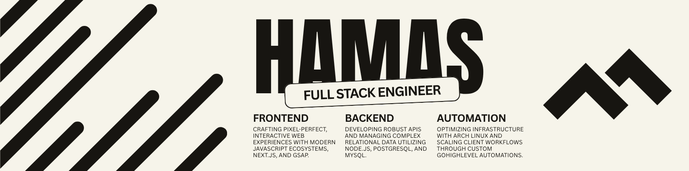

<!-- ═══════════════════ HEADER ═══════════════════ -->

  

`🟢 Available for Freelance`&nbsp;&nbsp;·&nbsp;&nbsp;`📍 Pakistan (PKT)`

 

&nbsp;

&nbsp;

&nbsp;

 

## About

I'm **Hamas Munawar**, a full-stack web engineer and automation architect focused on building reliable software and streamlined business systems. I work across two core disciplines — modern web application development and GoHighLevel-based automation — and share what I learn through content along the way.

- Building production-grade applications with **Next.js** and **Node.js**
- Designing **GoHighLevel** automations that reduce manual operational overhead
- Creating educational content on engineering and automation

> _Complexity is an opportunity._

 

## What I Do

<table>
<tr>
<td width="33%" valign="top">
<h3>Engineer</h3>
Full-stack applications built with Next.js, Node.js, and MongoDB/PostgreSQL — from storefronts to SaaS dashboards and internal tools.
</td>
<td width="33%" valign="top">
<h3>Automator</h3>
GoHighLevel CRM architecture, funnels, and workflow systems designed to scale agency operations efficiently.
</td>
<td width="33%" valign="top">
<h3>Creator</h3>
Technical content that breaks down engineering and automation concepts for a growing audience.
</td>
</tr>
</table>

 

## Tech Stack

**Languages**
 

 

**Frontend**
 

 

**Backend & Architecture**
 

 

**Databases**
 

 

**DevOps & Infrastructure**
 

 

**Tools**
 

 

**Automation & CRM**
 

&nbsp;

&nbsp;

  

**Content Creation**
 

&nbsp;

&nbsp;

 

## Journey

| Year         | Milestone                                                      |
| :----------- | :------------------------------------------------------------- |
| 2021         | First HTML/CSS lines, self-taught                              |
| 2021–23      | Intermediate in Computer Science — Punjab College              |
| 2022         | Focused on JavaScript frameworks and frontend architecture     |
| 2023         | Transitioned to backend development — Node.js, APIs, databases |
| 2023–Present | BS Software Engineering — NUML Islamabad                       |
| 2024         | Advanced into Next.js, tRPC, Payload CMS, system design        |
| 2024–Present | Began creating technical content                               |

 

## Services

| Service               | Details                                                                       |
| :-------------------- | :---------------------------------------------------------------------------- |
| **Next.js Frontends** | SSR/SSG, Core Web Vitals optimization, GSAP/Framer Motion, TypeScript-first   |
| **Backend & APIs**    | REST APIs, MongoDB/PostgreSQL schema design, JWT/OAuth, payment integration   |
| **Headless CMS**      | Payload CMS dashboards, Redux/Zustand state management, scalable architecture |
| **GHL Automation**    | Sub-account builds, funnels, CRM workflows, agency-scale systems              |
| **Deployment**        | CI/CD pipelines, Vercel/GitHub automation, audits, performance tuning         |
| **Technical Content** | Tutorials, documentation, and dev storytelling for brands and products        |

 

## GitHub Analytics

<picture>
  <source media="(prefers-color-scheme: dark)" srcset="https://raw.githubusercontent.com/engineer-hamas/engineer-hamas/output/github-contribution-grid-snake-dark.svg" />
  <source media="(prefers-color-scheme: light)" srcset="https://raw.githubusercontent.com/engineer-hamas/engineer-hamas/output/github-contribution-grid-snake.svg" />
  
</picture>

 

## Contact

|           |                                                                             |
| :-------- | :-------------------------------------------------------------------------- |
| Email     | [engineer.hamas.munawar@gmail.com](mailto:engineer.hamas.munawar@gmail.com) |
| Portfolio | [engineer-hamas.site](https://engineer-hamas.site)                          |
| X         | [@HamasMunawar\_](https://x.com/@HamasMunawar_)                             |
| Instagram | [@engineer.hamas](https://instagram.com/engineer.hamas)                     |

 

---

 

