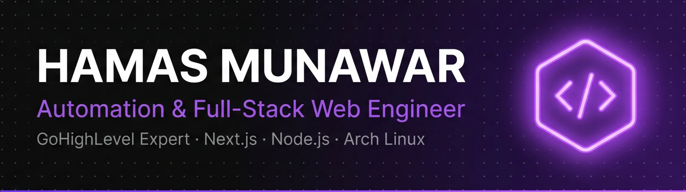

<!-- BANNER -->

  

 

<!-- TYPING ANIMATION -->

[;Open+to+Freelance+%26+Collaboration;Complexity+is+an+Opportunity.>)](https://git.io/typing-svg)

 

🟢 **Currently Online & Accepting Projects** · Pakistan `PKT`

 

---

## 👤 About Me

I'm **Hamas Munawar**, a dual-specialist **Automation & Full-Stack Web Engineer** based in Pakistan. I build two things exceptionally well:

- 🤖 **GoHighLevel & Automation Systems** — CRM architecture, workflow automation, funnels, and custom sub-account builds that scale agencies and businesses efficiently
- 🌐 **High-Performance Web Applications** — from cinematic e-commerce storefronts and SaaS dashboards to browser extensions and productivity tooling, built end-to-end with modern stacks

> _"Complexity is an Opportunity."_ — I thrive on projects others find too difficult to scope.

---

## 🎓 Education & Journey

| Period       | Milestone                                                                                   | Institution               |
| ------------ | ------------------------------------------------------------------------------------------- | ------------------------- |
| 2021         | 🔥 **The Spark** — First HTML & CSS experiments, self-taught from the ground up             | Self-Study                |
| 2021–2023    | 📚 **Intermediate in Computer Science (ICS)**                                               | Punjab College, Chishtian |
| 2022         | ⚡ **Frontend Progression** — Mastered JS frameworks & advanced architectural patterns      | Self-Study                |
| 2023         | 🔧 **Backend Transition** — Full-stack shift into Node.js, APIs, databases                  | Self-Study                |
| 2023–Present | 🎓 **Bachelor's in Software Engineering**                                                   | NUML Islamabad            |
| 2024         | 🚀 **Advancing to Full-Stack Frameworks** — Next.js, tRPC, Payload CMS, system architecture | Self-Study                |

---

## 🤝 Services I Offer

<b>🖥️ High-Performance Next.js & Frontend Engineering</b>

 

> Engineering lightning-fast, SEO-optimized user interfaces using **Next.js** and **React**. Focused on delivering smooth user experiences that load instantly and build immediate brand authority.

| Service                                 | Description                                             |
| --------------------------------------- | ------------------------------------------------------- |
| ⚡ Next.js Speed & Core Web Vitals      | SSR/SSG for perfect Lighthouse scores & Google rankings |
| 🎞️ Advanced Animations & Interactive UX | GSAP & Framer Motion for high-end interactive elements  |
| 🔒 Future-Proof Type-Safe Development   | TypeScript-first for scalable, bug-free frontends       |

<b>🗄️ Scalable MERN Stack Backend Architecture</b>

 

> Building the robust "brain" of your application using **Node.js** and **MongoDB**, prioritizing data integrity, secure authentication, and high-concurrency processing.

| Service                                 | Description                                                   |
| --------------------------------------- | ------------------------------------------------------------- |
| 🛡️ Secure API & Database Design         | RESTful APIs & MongoDB schemas optimized for speed & security |
| 🔑 Enterprise-Grade Authentication      | JWT / OAuth flows meeting modern security standards           |
| ⚙️ Complex Business Logic & Integration | Payment gateways, automated data reporting, custom workflows  |

<b>📝 Full-Stack Delivery & Headless CMS Solutions</b>

 

> End-to-end software delivery bridging complex data and user interfaces, utilizing **Payload CMS** for flexible content management.

| Service                                     | Description                                                                    |
| ------------------------------------------- | ------------------------------------------------------------------------------ |
| 🧩 Headless CMS Mastery (PayloadCMS)        | Tailored content dashboards — your team controls content without touching code |
| 🔄 State Management for Complex Apps        | Redux / Zustand for fluid, responsive data-heavy environments                  |
| 🗺️ Technical Roadmap & Scalability Planning | Architecture designed for millions of users from day one                       |

<b>☁️ Cloud Deployment, CI/CD & Technical Consulting</b>

 

> Managing the deployment lifecycle and infrastructure — always online, secure, and performing at its peak.

| Service                                  | Description                                            |
| ---------------------------------------- | ------------------------------------------------------ |
| 🔁 Automated Vercel & GitHub Workflows   | CI/CD pipelines for zero-downtime deployments          |
| 🔍 Deep Code Audits & Performance Tuning | Eliminate bottlenecks & drastically improve load times |
| 🤝 Long-term Architectural Guidance      | Strategic technical partner as your product scales     |

---

## 💼 Featured Projects

|  #  | Project                  | Client           | Industry                   | Impact                        |                                Link                                |
| :-: | ------------------------ | ---------------- | -------------------------- | ----------------------------- | :----------------------------------------------------------------: |
| 🥇  | **Issues Tracker**       | Internal Tooling | Business & Management      | Accelerated Project Delivery  |   [Source Code](https://github.com/hamas-munawar/Issues-Tracker)   |
| 🥈  | **Sehlvet Experience**   | Sehlvet          | Premium Menswear           | Brand Authority & Retention   |           [Live Store](https://sehlvet-store.vercel.app)           |
| 🥉  | **Kumo Store**           | Kumo Brand       | Retail / E-Commerce        | Seamless Shopping Experience  |            [Live Store](https://kumo-store.vercel.app)             |
|  4  | **YouTube Studio Suite** | Open Source      | Media Tooling & Automation | Streamlined Media Downloading | [Repository](https://github.com/hamas-munawar/youtube-downloader)  |
|  5  | **NUML QEC**             | Open Source      | Education & Automation     | Automated Feedback Processing | [Repository](https://github.com/hamas-munawar/numl-qec-evaluation) |
|  6  | **Game Hub**             | Independent      | Gaming & Entertainment     | Instant Content Discovery     |          [Live App](https://games-hub-tawny.vercel.app/)           |
|  7  | **Street Kickz**         | Street Kickz PK  | Retail / E-Commerce        | Elevated Sneaker Shopping     |             [Live Store](https://streetkickzpk.store)              |

---

## 🏅 Certifications

<b>View All Certifications (12)</b>

 

| Certificate                         | Instructor     |
| ----------------------------------- | -------------- |
| 🌐 Web Development Fundamentals     | SimpliLearn    |
| 🤖 Build AI-Powered Apps            | Code with Mosh |
| ⚛️ Mastering Next.js                | Code with Mosh |
| 🏗️ Next.js Project Development      | Code with Mosh |
| ⚛️ React 18 for Beginners           | Code with Mosh |
| ⚛️ React 18 Intermediate            | Code with Mosh |
| 🎨 The Ultimate HTML & CSS — Part 1 | Code with Mosh |
| 🎨 The Ultimate HTML & CSS — Part 2 | Code with Mosh |
| 🎨 The Ultimate HTML & CSS — Part 3 | Code with Mosh |
| 📜 The Ultimate JavaScript — Part 1 | Code with Mosh |
| 📜 The Ultimate JavaScript — Part 2 | Code with Mosh |
| 🟦 The Ultimate TypeScript          | Code with Mosh |

---

## 🛠️ Tech Stack

<b>🗣️ Languages</b>

 

        

<b>⚙️ Frameworks & Runtime</b>

 

    

<b>📦 Libraries & UI</b>

 

         

<b>🗄️ Databases & ORM</b>

 

   

<b>🔐 Auth & Architecture</b>

 

  

<b>📝 CMS & Content</b>

 

 

<b>🚀 DevOps & Infrastructure</b>

 

      

<b>🎨 Dev Tools & Design</b>

 

    

<b>🖥️ IDEs & Editors</b>

 

    

<b>⚡ Environment</b>

 

  

---

## 📊 GitHub Stats

<table>
  <tr>
    <td></td>
    <td></td>
  </tr>
</table>

 

 

 

---

## 🐍 Contribution Snake

<picture>
  <source media="(prefers-color-scheme: dark)" srcset="https://raw.githubusercontent.com/hamas-munawar/hamas-munawar/output/github-contribution-grid-snake-dark.svg" />
  <source media="(prefers-color-scheme: light)" srcset="https://raw.githubusercontent.com/hamas-munawar/hamas-munawar/output/github-contribution-grid-snake.svg" />
  
</picture>

---

### ✍️ Dev Quote

---

